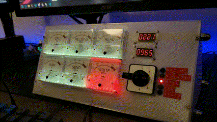

# sysMonGauge
Fancy System Monitoring Gauge

## Building
The panel is designed to be printed using a standard FDM 3D printer (hence the funky split down the middle), but it would probably be better if you used a laser cutter or CNC router to cut the panel out of plastic or wood.

The rods were machined out of aluminium bar stock, but M8 threaded rod would work just as well.

I build the circuit on perf-board, but PCB files are included.

The dials were printed out onto self-adhesive paper and trimmed around the existing metal dials the gauges came with.

## Parts

Parts list

### Hardware
- 3x 360mm M8 threaded rod
- 12x M8 nuts
- 8x M3 hex-head screw (to attach the panel to the wings)
- 8x M2 hex-head screws and nuts (to attach the 7 segment displays)
- Lots of glue and zip-ties ;)
### Electronics
- 6x 5mA ammeter *"85C1"*
- 1x 5 position rotary switch *"LW26"*
- 2x 0.36" 4-digit 7 segment display *"TM1637"*
- 1M 144 LED WS2812B LED strip
- 6x 1k variable resistor
- 1x Raspberry Pi Pico
##
- 1x 330uF 16V electrolytic capacitor
- 5x 3mm red LED with holder
- 6x JST XH 1x2 connector
- 1x JST XH 1x5 connector
- 2x JST XH 1x4 connector
- 1x JST XH 1x6 connector
- 1x 2N7000 (TO-92)
- 2x 10k resistor
- 2x 470k resistor

## Installation
Open a command prompt as administrator and run `install.bat` to install the server as a Windows service, make sure the panel is plugged in, and it should spring to life!

Alternatively, to run the server standalone, make sure the service is stopped (`python sysMonSender.py stop`), then run `python sysMonSender.py debug` as an administrator.
